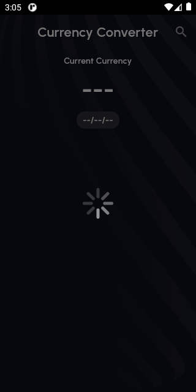
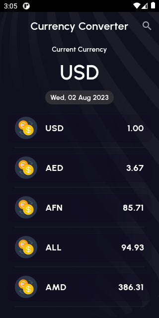
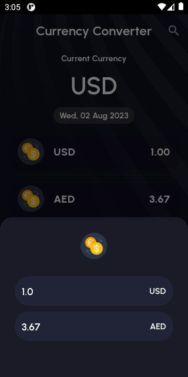
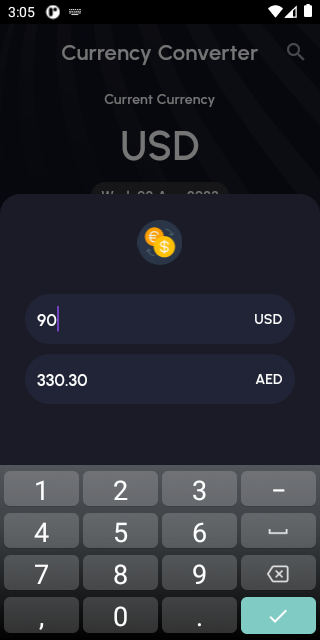
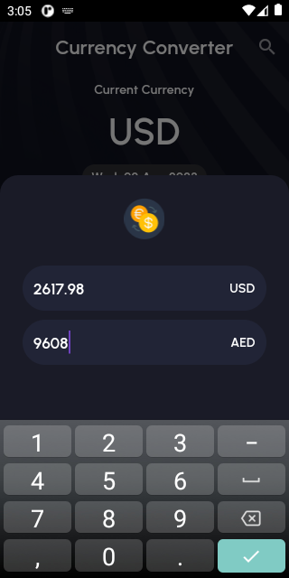
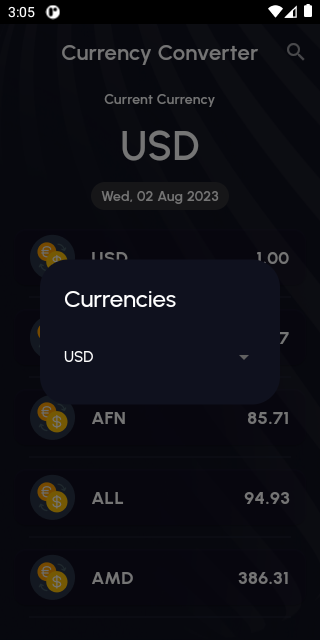
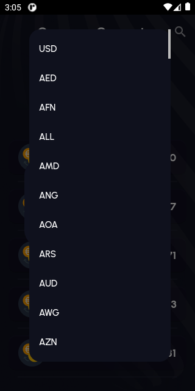
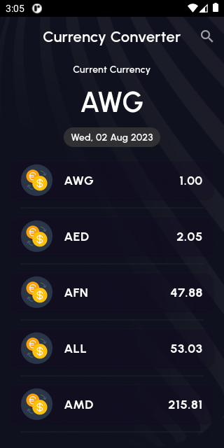

# Currnecy Converter App

Develop a project of currency coverter app assignment assigned by our instructor Muhammad Salman at Bano Qabil. Talking about app in this we Integrate REST Api from which I calculate every other currience and drop down menu.

Figma Design Link :[ Currency Converter](https://www.figma.com/file/DdZJ5nzWXjNX7l2NZ2ubsm/Currency-Converter?type=design&node-id=0-1&mode=design&t=XEZVQyDqjl8mwkfu-0) 

## Screen Shots

